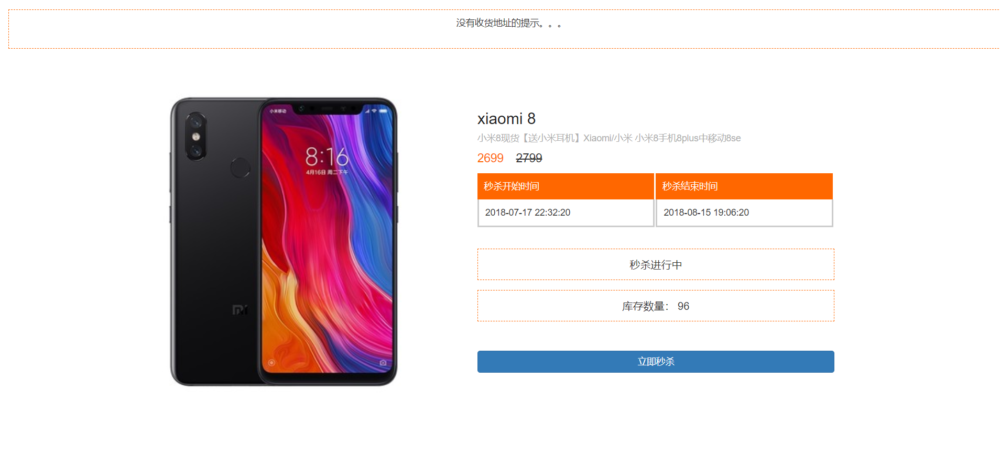
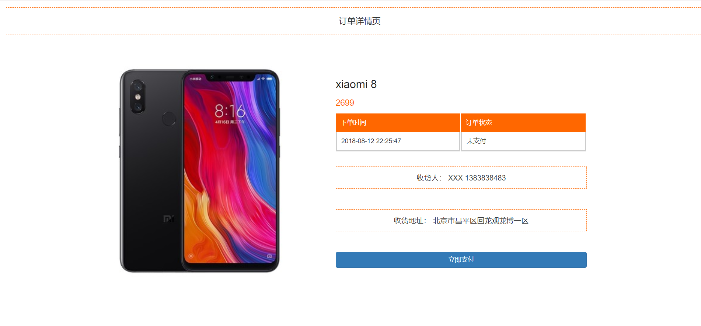

### 基于 SpringBoot+Mybatis+Redis+RabbitMQ 秒杀系统  

### 开发工具

idea  2017.2.3

### 开发环境

| JDK | Maven| Mysql  | SpringBoot | redis | RabbitMQ| 
| ------------- |:-------------:| -----:| ------------- |:-------------:| -----:|
| 1.8  | 3.2.2 | 5.7| 1.5.10.RELEASE | 3.2 |  | 

### 项目启动说明

1、启动前，请配置 application.properties 中相关redis、mysql、rabbitmq地址。

2、登录地址：http://localhost:8888/page/login

3、商品秒杀列表地址：http://localhost:8888/goods/list

### 其它说明

### 页面截图
登录页

商品列表情页

商品详情页

订单详情页

 
